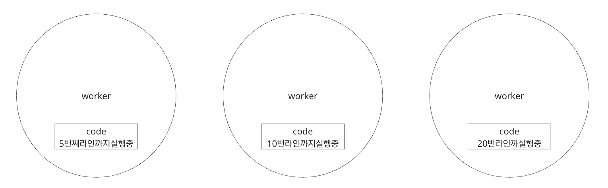
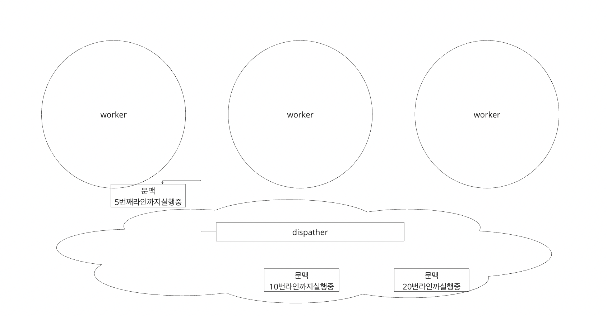
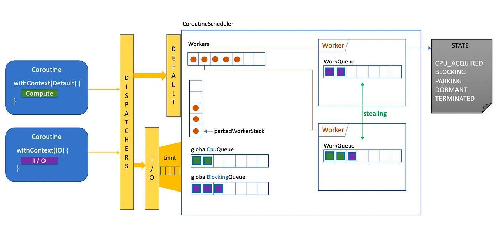
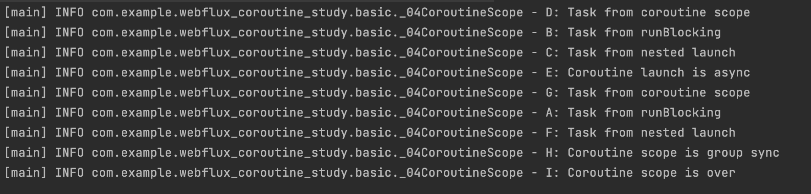
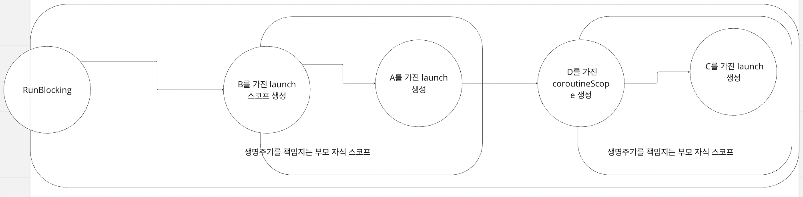

## 비동기 주요 개념들 이해하기

- Blocking : 특정 작업이 완료될 때 까지 작업자(일반적으로 스레드)가 대기상태로 있게 만드는 경우, 특정 작업의 반환을 작업자(스레드)는 기다려야한다.

- NonBlocking : 특정 작업의 완료를 기다리지 않고도 작업자가 다른 작업을 수행할 수 있도록 하는 경우, 특정 작업의 반환을 기다리지않으며 해당 반환은 다른 방법으로 받아봐야한다.(콜백)

- Sync :작업간 순차성을 유지하는 행위. a,b 로직이 동기라면 반드시 a → b 순서로 진행된다. 일반적인 코드 흐름은 모두 동기인셈

- aSync: 작업간 순차성이 유지되지 않으며 동시수행될 수 있다. a, b 로직이 비동기라면 항상 별개로 동작할 수 있다.

- callback : 비동기 프로그래밍 패턴중 하나. 비동기 로직간 동기화를 위해 사용한다. 특정 함수가 실행을 끝내고 동기적으로 실행시켜야 할 함수가 있을때 그 함수를 인자로 받아 동기화시킨다.

    - 인자로 받을수 있는 능력을 가졌다면 고차함수 -high order func

    - 인자가 될수 있고 반환이 될수 있는(변수로 다뤄질수 있는) 함수는 일급합수 - first class function

    // js는 비동기로 동작되므로
    
    function afunction(a, callback) {
    console.log('a');
    setTimeout(callback, 1000);
    }
    
    function cfunction() {
    console.log('b');
    }
    
    function main() {
    afunction('a', cfunction);
    console.log('c');
    }
    
    main();  // afunction 호출 -> 'a' 출력 -> setTimeout 시작 -> 'c' 출력 -> setTimeout 완료 후 cfunction 호출 -> 'b' 출력

- promise, future : 비동기 작업의 결과로, 나중에(비동기로직이 끝나고) 반환값이 생길것이라고 기대되는 개념, 개념구현체. “나중에 완료될 값“

- 이벤트 루프 : 자스 비동기 메커니즘으로 비동기를 수행하는 방식.

  1. 실행할 태스크를 확인하면 콜스택에 추가한다.

  2. 콜스택에서 태스크를 하나 가져와 실행한다.

  3. 만약 비동기 작업이 있다면 이를 기다리지 않고 이벤트 테이블에 작업을 넣는다.

  4. 이벤트 테이블은 비동기작업이 완료되었는지 감시하고 완료되면 이 작업에 대한 콜백함수를 이벤트 큐에 추가한다.

  5. 콜스택이 비었으면 이벤트큐에서 태스크를 가져와 콜스택에 넣는다.

  6. 루프

- 리액티브 프로그래밍 : 복잡한 비동기 프로그래밍 문제를 처리하기 위한 패러다임으로 데이터의 흐름(스트림)과 변화(이벤트)에 반응하여 동작. 비동기를 관리하는 메커니즘

- 웹플럭스와 리액터 : 비동기 작업을 처리하기위한 쓰레드풀이 존재하며, 해당 쓰레드들은 논블로킹 작업을 수행할 경우 작업이 완료되길 기다리지 않고 다른요청을 계속 수행할 수 있다. 이때 스케줄러가 비동기 작업에 대한 완료를 감지하며, 결과를 이벤트 스트림으로 전달한다. 이는 Mono(이벤트 0~1), Flux(0~N)로 표현되며 완료 이벤트를 전달받으면 방출 가능하다.

## 코루틴 기초

코루틴함수를 일반함수와 비교해서 이해해보자

- 일반함수 : 스레드가 함수를 호출하면 스레드가 소유하는 스택에 스택 프레임이 생성된다. 스택 프레임에는 함수의 지역변수, 매개변수, 복귀주소등이 포함된다. 스레드는 스택 프레임을 관리하고 함수의 실행 흐름을 제어한다.

스레드가 실행흐름을 제어하고 알고있다

- 코루틴 함수 : 코루틴은 스택프레임을 생성하지 않으며, 스레드의스택에 존재하지도 않는다!

코루틴은 자체적으로 관리되는 상태 및 실행 컨텍스트를 코루틴 객체 내부에 저장하며 이는 힙영역에 존재한다. 즉 코루틴 함수는 매 호출마다 스레드의 스택프레임에 그 문맥이 생기는개념이아니라, 코루틴 객체가 고유한 컨텍스트를 가지고 생성이되며 매 상태, 변수, 실행컨텍스트가 다 저장된다.

이런 코루틴은 코루틴 스케쥴러에 의해 관리되고 디스패쳐 의해 분배되며 만약 논블로킹 suspend지점을 만나면 일시중지되고 제어는 디스패처에 반환된다.

디스패처에 의해 워커에게 줬다가 suspend되면 회수하고 다시 실행가능해지면 다른 워커에 주면 된다

여기서 CoroutineScheduler는 Java.Executor 의 구현체!

corePoolSize : 최소로 유지되는 Worker 수

maxPoolSize : 최대 Worker 수

idleWorkerKeepAliveNs : 지정된 나노 초가 지난 유휴 Worker 는 제거

코루틴 코드는 CPS(continuous passing style)로 작성되어있으며, 일반 함수에 suspend를 붙이면 코틀린컴파일러가 흑마법을 부려 CPS 형태의 코루틴 객체가 되는 바이트코드를 만들어준다.

##  코루틴 스코프 빌더

코루틴의 실행 범위 및 생명 주기를 관리하는 메커니즘.

스코프 내에서 실행되는 모든 코루틴은 해당 스코프의 생명중기에 종속적이다.

코루틴은 모든 자식 코루틴의 완료를 책임진다.

CoroutineScope 인터페이스

생명주기 관리의 어려움을 해결해주는것이 핵심! - 만약 중간에 문제가 생기면 해당 스코프를 일괄 종료한다던가, 하위 스코프가 모두 종료될때까지 대기해야한다던가 하는 것들

구조화된 병렬처리 제어!

### GlobalScope

    @DelicateCoroutinesApi
    fun main() {
    GlobalScope.launch {
    delay(1000L) // 1초간 논블로킹으로 기다린다.
    println("World!") // 지연 후 출력
    }
    println("Hello,") // 메인 스레드가 코루틴이 지연되는 동안 계속 실행된다.
    Thread.sleep(2000L) // JVM이 종료되지 않게 메인 스레드를 블로킹한다. globalScope의 특징때문!
    }

프로그램의 전체 생명 주기 동안 존재하는 전역적인 코루틴 스코프

전역적이기때문에 스코프 생명주기 관리가 어렵고 자원누수의 위험이 존재

실무적으로는 사용X

### RunBlocking

    private val log = KotlinLogging.logger { }
    
    @DelicateCoroutinesApi
    fun main() {
    GlobalScope.launch {  // GlobalScope.launch는 메인스레드를 블로킹하지 않는다.
    delay(1000L)
    log.info("World!")
    }
    log.info("Hello,")
    runBlocking { // runBlocking은 메인스레드를 블로킹한다.
    delay(2000L)
    log.info("!!")
    }
    log.info("이게 마지막에 실행될거임 ㅅㄱ")
    }

주어진 블록이 완료될 때까지 현재 스레드를 멈추는 새로운 코루틴을 생성하여 실행하는 코루틴 스코프 빌더

블로킹 로직이 존재한다는걸 명시적으로 나타내기위해 사용가능

하지만 권장 X

일반함수에서 suspend 함수를 호출할수 있도록하기위해 존재하는 브릿지일뿐, 코루틴내에서는 블로킹에 대한 코드는 쓰지말자

### launch - job

    @DelicateCoroutinesApi
    fun main() = runBlocking {
    //    val job : Job = GlobalScope.launch { // GlobalScope.launch는 runBlocking의 자식 스코프가 아니므로 생명주기를 책임지지 않는다.
    //        delay(1000L)
    //        println("World!")
    //    }
    val job : Job = launch {// runBlocking의 자식 스코프이므로 생명주기를 책임진다.
    delay(1000L)
    println("World!")
    }
    println("Hello,")
    //    job.join() // async await 느낌, globalScope라면 생명주기가 다르므로 join을 해줘야함
    }

새로운 코루틴을 시작하고, 작업이 진행되는 동안 제어를 즉시 반환한다. 반환 객체는 job.

특정 결과를 기다릴 필요 없이 별도로 백그라운드 작업을 실행하고자할때 주로 사용하며 가장 일반적으로 사용하는 빌더

Job : 제어를 위한 객체. job.join() 처럼하면 해당 작업이 완료될때까지 기다릴 수 있음, 여기서 중요한점은 blocking이 아니라 suspend이므로 스레드는 문제없다!

cancel, isActive등

반환값이 없다는점 명심!

어차피 부모가 생명주기를 책임지므로 자식 코루틴에대한 join()을 특별히 할 필요가없음

### coroutineScope

부모 코루틴과 독립적인 별도의 코루틴을 새로 생성한다. 이때 부모 코루틴은 suspend된다.

        private val log = mu.KotlinLogging.logger { }
        
        fun main() = runBlocking {
        launch {// launch로 스코프를 생성하면 부모와 함께 병렬로 상태머신이 돈다
        launch {
        delay(1000L)
        log.info("A: Task from runBlocking")
        }
        delay(200L)
        log.info("B: Task from runBlocking")
        }
        
            coroutineScope {// 코루틴 스코프 생성 코루틴 스코프 안의 코드가 다 처리되기전까진 블록 아래 코드가 실행되지 않는다
                launch {// 코루틴 스코프 내에서 새로운 코루틴 생성
                    delay(500L)
                    log.info("C: Task from nested launch")
                }
                delay(100L)
                log.info("D: Task from coroutine scope")
            }
        
            log.info("E: Coroutine launch is async")
        
            coroutineScope {// 코루틴 스코프 생성 - 상태머신이 코루틴스코프 빌더 와 그 상단에서만 라벨링을 돈다
                launch {// 코루틴 스코프 내에서 새로운 코루틴 생성
                    delay(500L)
                    log.info("F: Task from nested launch")
                }
                delay(100L)
                log.info("G: Task from coroutine scope")
            }
        
            // 코루틴 스코프가 끝나면 상태머신이 다시 부모로 돌아간다
            log.info("H: Coroutine scope is group sync")
            log.info("I: Coroutine scope is over")
        }

- 어느순서로 실행될까?

- 20번라인까지 흐름

각각의 컨텍스트상 suspend된 delay가 끝나는 순서대로 D,B,C가 실행되고(얼추 5xxms) coroutineScope가 끝났으므로 runBlocking의 suspend가 해제되어 이후 E출력

G코루틴스코프와 F도 생성되고 G출력후 A출력, F출력

runBlocking suspend 해제로 이후 출력

### Async

코루틴을 실행하고 Deferred 객체를 반환. Deferred 객체는 코루틴의 결과를 나타내며, await 함수를 통해 결과를 기다릴 수 있다. 결과를 기다리는 동안 현재 코루틴은 블로킹되지 않습니다. async는 결과를 반환하는 별도의 작업을 백그라운드에서 실행하려는 경우에 사용.

사실상 job과 동일하나 반환값이 존재한다는 차이!

### SupervisorScope

coroutineScope와 유사하지만, 하나의 자식 코루틴이 실패하더라도 다른 코루틴에 영향을 미치지 않는다. 일반적으로 여러 개의 독립적인 작업을 병렬로 실행하면서, 하나의 작업 실패가 다른 작업에 영향을 미치지 않도록 하고 싶을 때 사용

### 더알아보기

// 코루틴을 관리하는 접근법 : 명시적으로 CoroutineScope을 필드로 갖는 클래스 만들기
class MyCoroutineClass : CoroutineScope by CoroutineScope(Dispatchers.Default) {

    fun startCoroutines() {
        launch {
            log.info("Starting coroutine 1")
            delay(1000)
            log.info("Coroutine 1 is done")
        }

        launch {
            log.info("Starting coroutine 2")
            delay(2000)
            log.info("Coroutine 2 is done")
        }
    }

    // 클래스가 더 이상 사용되지 않을 때 코루틴을 정리
    fun cleanUp() {
        cancel()
    }
}

fun main() = runBlocking {
val myCoroutineClass = MyCoroutineClass()

    myCoroutineClass.startCoroutines()

    delay(3000)

    myCoroutineClass.cleanUp()
}

코루틴 스코프를 이용해 코루틴생명주기를 관리하는 방법